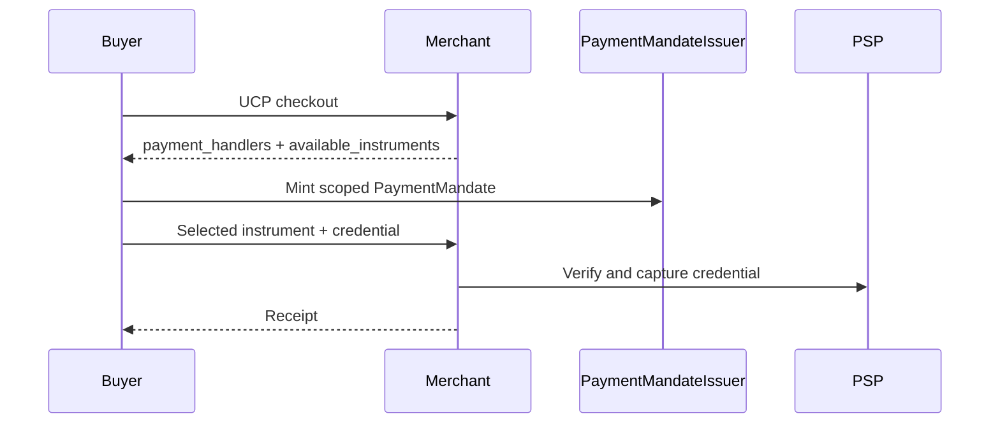

# Steelyard

Steelyard is a TypeScript SDK for defining commerce once, serving it as static
`commerce.json`, plain HTTP, MCP, ACP, and UCP, and letting buyers complete
agentic purchases through a local encrypted `Wallet`.

The payment model has two explicit modes:

- `agent-native`: the wallet issues scoped `PaymentMandate`s such as Stripe
  SPT authorizations, PSP-specific payment tokens, or x402 payment payloads.
- `browser-manual`: the wallet stores legacy vaulted cards and exposes a
  `BrowserManualSession` for browser automation or manual checkout flows.

## Quickstart (under 2 minutes)

```sh
npm install steelyard
```

```ts
import { defineCommerce, serveCommerce } from "steelyard";

const manifest = defineCommerce({
  identity: { name: "My Shop", domain: "shop.example", currencies: ["USD"] },
  offers: [
    {
      id: "single",
      title: "Single Espresso",
      availability: "in_stock",
      pricing: [{ kind: "one_time", amount: 300, currency: "USD" }]
    }
  ]
});

serveCommerce(manifest).listen(3000);
```

```sh
curl localhost:3000/.well-known/commerce.json
```

That one `serveCommerce` call exposes your catalog over **all five read surfaces**
from a single manifest: `/.well-known/commerce.json`, the `/commerce` HTTP API,
`/mcp`, `/acp/feed`, and `/.well-known/ucp` + `/api/catalog/*`. Read-only by default,
no PSP required. The single `steelyard` package re-exports the symbols most
integrators need (`defineCommerce`, `serveCommerce`, `createCheckoutServer`,
`Wallet`, `vaultedCard`, `stripeSpt`, `x402Payments`, `x402Fetch`, `stripePsp`, …); see
[`packages/steelyard`](packages/steelyard/README.md).

## Next.js Quickstart

```sh
npx steelyard init
```

In a Next.js 14+ App Router app, this writes the route handlers for the four
Steelyard surfaces (`/.well-known/commerce.json`, `/mcp`, `/acp/feed`,
`/.well-known/ucp`), a `commerce.ts` manifest stub, and an optional dev
inspector at `/steelyard`, then installs `steelyard`
with your project's package manager (pass `--skip-install` to skip). If a
Stripe API key is found, it offers to import your existing Stripe catalog.
Discovery is fully wired today. `steelyard enable checkout` lays the
tier-B foundation (verifies your Stripe key, checks that your account
has the agentic-payments capability enabled, flips the tier flag) — the
generated merchant checkout endpoint that actually accepts agent
purchases ships in a follow-up release.

See `examples/nextjs/` for a deployable reference app.

## Advanced: individual packages

The umbrella is a front door, not a wall. Import any specific package directly when
you need the full surface:

```sh
npm install steelyard
```

For local development of this monorepo:

```sh
pnpm install --frozen-lockfile
pnpm -r build
pnpm -r test
```

`defineCommerce(...)` builds the manifest; pass it to `steelyard/protocol/mcp`,
`/acp`, and `/ucp` for per-protocol control, to `createCommerceReadHandler()`
for a read-only router, or to `createCheckoutServer()` to mount ACP and UCP
checkout routes.

## Agent-Native Payments

UCP payment handlers are now adapter-neutral. Stripe SPTs remain supported, and
the guarded reference PSP proves the same UCP checkout path can use another
instrument type:

ACP remains intentionally direct Stripe SPT-only while UCP handles
adapter-neutral credentials.



```ts
const wallet = await Wallet.open();
await wallet.addInstrument(stripeSpt({ apiKey }));
const merchant = await Steelyard.connect("https://shop.example/.well-known/ucp", opts);
const offer = await merchant.getOffer("single");
const receipt = await wallet.purchase(intentFromOffer(offer), { merchant });
console.log(receipt.reference.ucp?.psp_payment_id);
```

See `docs/concepts/agentic-payment.md` and
`docs/concepts/payment-adapters.md` for UCP adapter wiring. See
`docs/guides/stripe-test-mode-setup.md` for Stripe Test mode requirements and
ACP's current Stripe SPT path.

## Signed UCP Checkout

v0.4.2 adds UCP HTTP Message Signatures for checkout traffic. Buyers can sign
requests with a vault-backed ES256 or ES384 UCP signing key, advertise their
public key through a UCP profile, and verify signed merchant completion
responses. Merchants can accept HMS, bearer tokens, or both.

See `docs/guides/configuring-ucp-auth.md` for operator configuration.

## x402 Paid HTTP Resources

x402 is for paid API calls and other HTTP resources. It is separate from
ACP/UCP commerce checkout and does not require a Steelyard manifest.

```ts
import { Wallet, x402Fetch, x402Payments } from "steelyard";

const wallet = await Wallet.open({ project: true });

await wallet.addInstrument(x402Payments({
  signer,
  networks: ["eip155:84532"],
  assets: ["USDC"],
  schemes: ["exact"]
}));

const fetchPaid = x402Fetch(wallet, {
  maxAmount: { amount: "0.10", currency: "USDC" }
});

const response = await fetchPaid("https://api.example.com/paid-weather");
console.log(response.x402?.receipt.transaction);
```

The wallet runs local policy before signing any x402 payment payload. Signer
adapters are bring-your-own; public APIs and examples do not accept raw private
key strings. See `docs/concepts/x402.md`.

## v0.4 Read-Side Surfaces

Serve the well-known commerce manifest and plain HTTP read API from the same
manifest:

```ts
import { createServer } from "node:http";
import { createCommerceManifestHandler } from "steelyard/protocol/commerce-manifest";
import { createHttpApiHandler } from "steelyard/protocol/http";

const wellKnown = createCommerceManifestHandler(manifest, {
  peers: {
    acp: { url: "https://coffee.example/acp/feed", protocol_version: "2026-04-17" },
    ucp: { url: "https://coffee.example/.well-known/ucp", protocol_version: "2026-04-17" },
    mcp: { url: "https://coffee.example/mcp", protocol_version: "0.1" },
    http: { url: "https://coffee.example/commerce", protocol_version: "0.1" }
  }
});
const httpApi = createHttpApiHandler(manifest);

createServer((req, res) => {
  if (req.url?.startsWith("/.well-known/commerce.json")) return wellKnown(req, res);
  if (req.url?.startsWith("/commerce")) return httpApi(req, res);
  res.writeHead(404).end();
});
```

Validate a running server:

```sh
steelyard validate https://coffee.example/.well-known/commerce.json
pnpm --filter steelyard-example-coffee-shop smoke:well-known
```

Generate static `commerce.json` for a CDN:

```sh
pnpm --filter steelyard-example-coffee-shop build
steelyard manifest ./examples/coffee-shop/dist/catalog.js \
  --module \
  --export coffeeShopManifest \
  --peer acp=https://coffee.example/acp/feed \
  --protocol-version acp=2026-04-17 \
  --peer ucp=https://coffee.example/.well-known/ucp \
  --protocol-version ucp=2026-04-17 \
  --peer mcp=https://coffee.example/mcp \
  --protocol-version mcp=0.1 \
  --peer http=https://coffee.example/commerce \
  --protocol-version http=0.1 \
  --generated-at 2026-06-14T00:00:00.000Z \
  --pretty \
  > public/commerce.json
```

## Demo

Demo video placeholder: https://www.loom.com/share/STEELYARD_V1_DEMO_PLACEHOLDER

```sh
pnpm --filter steelyard-example-coffee-shop build
PORT=3000 pnpm --filter steelyard-example-coffee-shop start
```

In another terminal:

```sh
steelyard-agent --merchant http://127.0.0.1:3000/mcp "what does this shop sell"
```

Transcript with `ANTHROPIC_API_KEY` unset:

```text
(running without LLM; export ANTHROPIC_API_KEY for natural-language prompts)
[
  {
    "id": "cappuccino",
    "title": "Cappuccino",
    "description": "Espresso with steamed milk and foam.",
    "images": [],
    "url": "https://coffee.example/cappuccino",
    "kind": "product",
    "categories": [],
    "attributes": {},
    "availability": "in_stock",
    "pricing": [
      {
        "kind": "one_time",
        "amount": 500,
        "currency": "USD"
      }
    ]
  },
  {
    "id": "double",
    "title": "Double Espresso",
    "description": "Two espresso shots served short.",
    "images": [],
    "url": "https://coffee.example/double",
    "kind": "product",
    "categories": [],
    "attributes": {},
    "availability": "in_stock",
    "pricing": [
      {
        "kind": "one_time",
        "amount": 450,
        "currency": "USD"
      }
    ]
  },
  {
    "id": "single",
    "title": "Single Espresso",
    "description": "A focused single shot of espresso.",
    "images": [],
    "url": "https://coffee.example/single",
    "kind": "product",
    "categories": [],
    "attributes": {},
    "availability": "in_stock",
    "pricing": [
      {
        "kind": "one_time",
        "amount": 300,
        "currency": "USD"
      }
    ]
  }
]
```

The full coffee-shop example contains Single Espresso, Double Espresso, and
Cappuccino. The integration test boots the merchant and proves MCP
`list_offers`, ACP `/acp/feed`, and UCP `/api/catalog/search` return the same
canonical offer list.

Run an end-to-end mock purchase:

```sh
STEELYARD_ALLOW_MOCK_PSP=1 \
STEELYARD_ALLOW_MOCK_MANDATE=1 \
pnpm --filter steelyard-example-coffee-shop buy:real -- --protocol acp

STEELYARD_ALLOW_MOCK_PSP=1 \
STEELYARD_ALLOW_MOCK_MANDATE=1 \
pnpm --filter steelyard-example-coffee-shop buy:real -- --protocol ucp

STEELYARD_ALLOW_MOCK_PSP=1 \
pnpm --filter steelyard-example-coffee-shop smoke:bearer
```

## Wallet

```ts
import type { PurchaseIntent } from "steelyard/core";
import { Wallet } from "steelyard/buyer";
import { Steelyard } from "steelyard/buyer/client";

const wallet = await Wallet.open();
const intent: PurchaseIntent = {
  merchant: {
    domain: "coffee.example",
    transport_url: "https://coffee.example/acp/feed",
    protocol: "acp"
  },
  offer: { id: "cappuccino", title: "Cappuccino", categories: ["coffee"] },
  amount: 500,
  currency: "USD"
};

const merchant = await Steelyard.connect("https://coffee.example/acp/feed", {
  delegatePaymentUrl: "https://psp.example/agentic_commerce/delegate_payment"
});
if ("error" in merchant) throw new Error(merchant.error_detail ?? merchant.error);

const receipt = await wallet.purchase(intent, { merchant, idempotencyKey: "purchase_123" });
```

`PurchaseIntent.amount` is the maximum amount authorized for merchant checkout;
reconcile the final captured amount from the returned receipt.

Power users can still import `Steelyard` from `steelyard/buyer/client`,
`WalletRules` from `steelyard/buyer/policy`, and `BuyerVault` from
`steelyard/buyer/vault`.

## Port Note

Steelyard is a clean spin-off from `../mercato/`. The public repo keeps the
manifest, validation, protocol adapter, wallet, and checkout SDK surfaces, and
drops ingestion, platform connectors, and hosted cloud UI.
