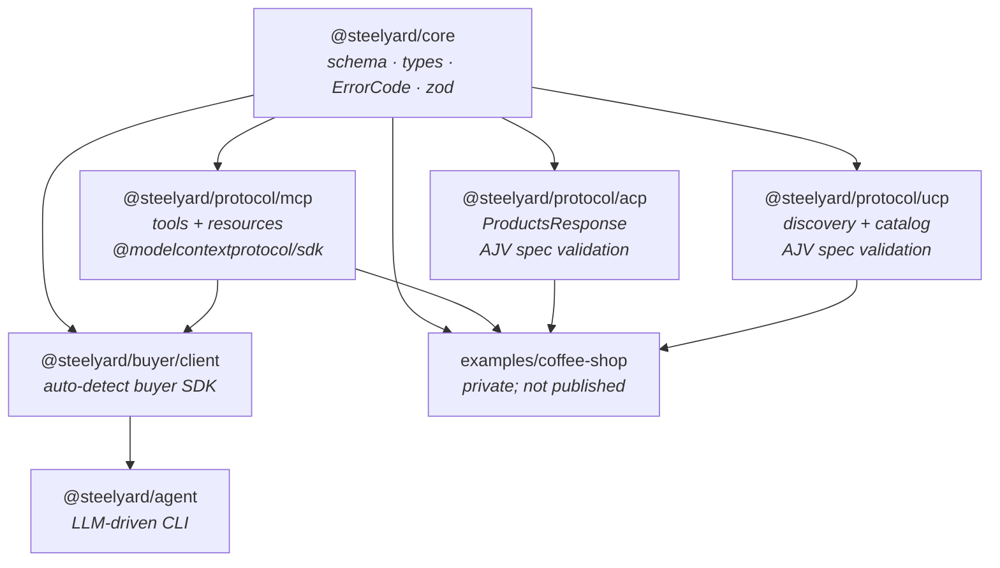
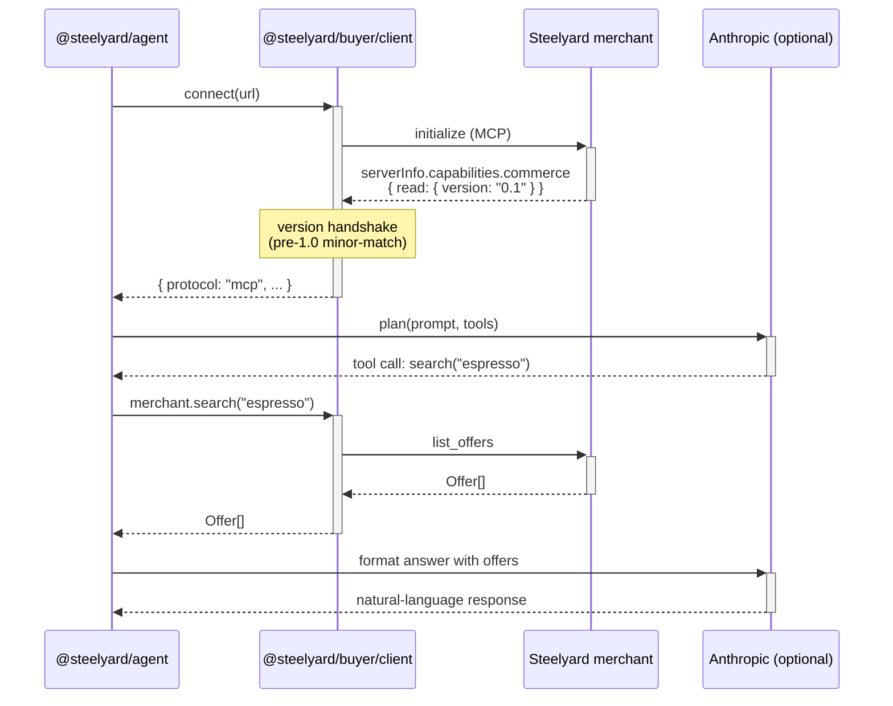

# Architecture

## Package dependency graph

A CI lint rule enforces that `@steelyard/core` does **not** import from any
payment adapter, LLM provider, or framework. The dependency graph is
acyclic and protocol-agnostic at the core.

## Round-trip buyer flow (MCP example)

The same `Steelyard.connect(url)` call works for ACP and UCP merchants —
the protocol detection is opaque to consumers.

## Spec discipline

Every protocol adapter validates its output against the vendored spec at
emit time:

| Adapter | Validator | Schema |
|---------|-----------|--------|
| `@steelyard/protocol/acp` | AJV2020 | `protocols/acp/spec/2026-04-17/json-schema/schema.feed.json` |
| `@steelyard/protocol/ucp` (discovery) | AJV2020 | `protocols/ucp/source/schemas/ucp.json` + transitive deps |
| `@steelyard/protocol/ucp` (catalog) | AJV2020 | `protocols/ucp/source/schemas/shopping/catalog_*.json` |
| `@steelyard/protocol/mcp` | — | Uses the official `@modelcontextprotocol/sdk`; conformance is by construction |

Bugs that would produce non-conformant output throw at emit time with the
specific spec violation. **No fake / incomplete stuff.**

## What's vendored

The protocol spec repos are vendored at `protocols/{acp,ucp,mcp}/` and
pinned to known-good versions:

- **ACP:** `2026-04-17` (json-schema, openapi, openrpc)
- **UCP:** `2026-04-08` (schemas + shopping service definition)
- **MCP:** runtime is `@modelcontextprotocol/sdk` ≥ 1.29

Bumping a spec version is a deliberate change: re-vendor, run the full test
suite (which includes adversarial spec-tampering cases), and ship a minor
release.

## What's next

- :material-protocol: [MCP](protocols/mcp.md), [ACP](protocols/acp.md),
  [UCP](protocols/ucp.md) — per-protocol surface details.
- :material-tag: [Versioning](concepts/versioning.md) — the read-side
  capability rule.
