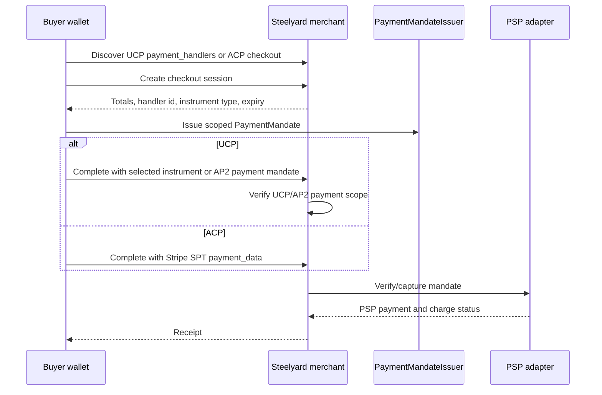

# Agentic Payment

Steelyard makes the checkout loop explicit while keeping UCP payment adapters
neutral. Merchants advertise accepted instruments as UCP payment handlers,
buyers select agent-native wallet instruments by instrument type, and the
merchant adapter verifies the resulting `PaymentMandate` before capture.
Stripe SPT remains supported, and the guarded reference PSP validates the same
UCP shape with `delegated_payment_token` mandates.

On UCP, a checkout can run with AP2 payment mandates or direct selected
instruments. In AP2 sessions, the payment instrument is embedded inside
the AP2 payment mandate's existing `payment_instrument` claim, so the merchant
can verify user consent before handing the mandate to the PSP. In direct UCP
sessions, the selected instrument carries the payment mandate issuer's
advertised `instrumentType`.

On ACP, there is no AP2 envelope in v0.7. The buyer sends the raw SPT in ACP
`payment_data.instrument.credential.token`, protected by ACP bearer auth and
the ACP webhook `Merchant-Signature` verifier. ACP remains intentionally
Stripe SPT-only in this release.

The practical result is the public promise in the README: define commerce once,
then expose it everywhere. UCP can use adapter-neutral accepted instruments,
while ACP keeps its narrower direct Stripe SPT boundary. Real Stripe payment
completion requires a Stripe account that can mint SPTs for a network business
profile.

See also:

- [Payment mandates](payment-mandates.md)
- [Payment adapters](payment-adapters.md)
- [Payment handlers](payment-handlers.md)
- [Stripe SPT errors](stripe-spt-errors.md)
- [Stripe test-mode setup](../guides/stripe-test-mode-setup.md)
