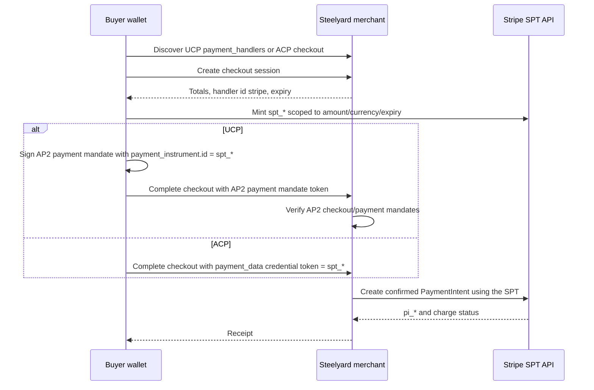

# Agentic Payment

Steelyard v0.6 makes the checkout loop explicit across UCP and ACP by using
Stripe Shared Payment Tokens (SPTs) as the payment instrument. The SDK path is
validated with offline Stripe smokes in this release; real Stripe SPT minting
and PaymentIntent capture are opt-in diagnostics until the operator's Stripe
account has business-profile/SPT access.

On UCP, the buyer signs AP2 checkout and payment mandates. The raw SPT is not
placed directly in `payment.instruments[*].credential.token`; that field still
carries the AP2 payment mandate SD-JWT+KB. The SPT is embedded inside the AP2
payment mandate's existing `payment_instrument` claim, so the merchant can
verify user consent before handing the SPT to the PSP.

On ACP, there is no AP2 envelope in v0.6. The buyer sends the raw SPT in ACP
`payment_data.instrument.credential.token`, protected by ACP bearer auth and
the ACP webhook `Merchant-Signature` verifier.

The practical result is the public promise in the README: define commerce once,
then expose it everywhere, with UCP and ACP sharing one payment-shaped adapter
path. Real Stripe payment completion requires a Stripe account that can mint
SPTs for a network business profile.

See also:

- [Payment mandates](payment-mandates.md)
- [Payment handlers](payment-handlers.md)
- [Stripe SPT errors](stripe-spt-errors.md)
- [Stripe test-mode setup](../guides/stripe-test-mode-setup.md)
