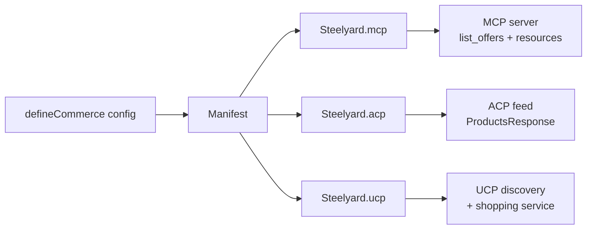

# The unification thesis

ACP, UCP, and MCP are all open-source. They are all live. They are all
**incompatible**. Steelyard is the abstraction that makes you not have to
pick.

## The protocol war (June 2026)

| Protocol | Backers | Shipped | What it is |
|----------|---------|---------|------------|
| **ACP** | OpenAI, Stripe, Meta | 2025-09-29 → 2026-04-17 (6 specs in 6 months) | A feed + cart + delegated-payment protocol |
| **UCP** | Google, Shopify | 2026-04-08 release used by Steelyard v1 | A discovery + service-bound capability protocol |
| **MCP** | Anthropic | `@modelcontextprotocol/sdk` ≥ 1.29 | The agent runtime substrate; ACP and UCP both bind to it |

Each protocol assumes its own commerce vocabulary, its own product shape, its
own way of advertising capability. A merchant that wants to be reachable by
all three agent runtimes has to maintain three implementations and keep them
synchronized.

## The bet

Protocol wars rarely converge cleanly. Railroad gauges, USB-C vs Lightning,
REST vs GraphQL — fragmentation persists for years. Steelyard's value grows
the longer the war drags on.

If two of the three protocols *did* merge, the abstraction layer would get
thinner — but not disappear. Steelyard is sized to be useful in either
universe.

## How Steelyard breaks the tie

You write `defineCommerce({...})` **once**:

Each adapter takes the same `Manifest` and emits a protocol-conformant
surface. The shapes differ because the specs differ — that is the whole point.
What does not differ is the source of truth.

## What this buys you

- **One config to update** when you add a product, change a price, or revise a
  policy. All three protocol surfaces reflect the change on the next request.
- **Real spec compliance.** Steelyard validates ACP feeds against the
  vendored `schema.feed.json` with AJV at emit time. UCP catalog responses
  are AJV-validated against the official `catalog_search.json` and
  `catalog_lookup.json` schemas. MCP uses the official SDK.
- **A unified buyer SDK.** `@steelyard/buyer/client` connects to a merchant, sniffs
  which protocol it speaks, and returns the **same** `Merchant` handle
  regardless. Methods like `search()` and `getOffer()` return identical
  results across all three.

## What v1 doesn't do

- **No payment execution.** ACP's checkout primitive, UCP's payment handlers,
  and any wallet delegation are deferred to v2. They need a careful design
  for trust boundaries, idempotency, SCA/3DS, and consent — and we want to
  ship the read-side first to build that design on real usage.
- **No store of merchant state.** v1 is a library, not a backend. The
  merchant runs `defineCommerce()` in its own process; Steelyard doesn't
  proxy or cache for you.
- **No buyer SDK against arbitrary non-Steelyard merchants.** v1 buyer
  detection is tuned for Steelyard's emit conventions. Hardening it to
  read any ACP/UCP/MCP commerce server in the wild is v1.1.

## What's next

- :material-script-text: [`defineCommerce`](define-commerce.md) — the
  shape of the config.
- :material-protocol: [Protocols](../protocols/mcp.md) — what each
  surface looks like on the wire.
- :material-shopping-search: [`@steelyard/buyer/client`](../packages/client.md) —
  the buyer SDK that consumes any of the three.
